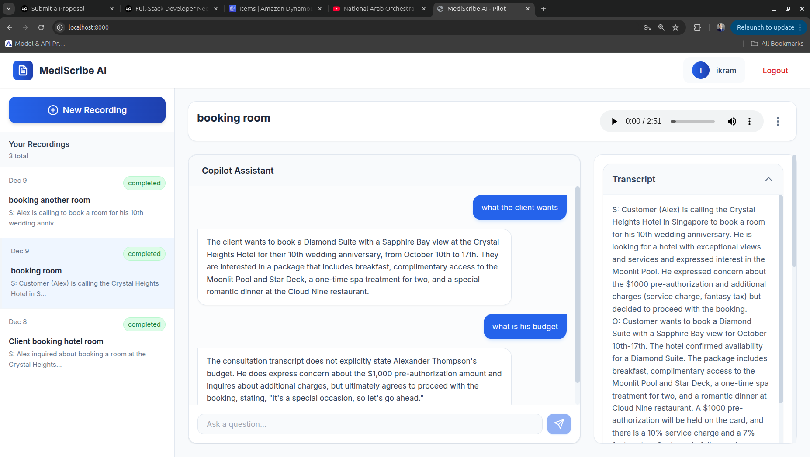

# Healthcare AI Audio POC

This is a Proof of Concept for a healthcare application that integrates AI and audio processing.

## Features
- **Audio Recording/Upload**: Record patient consultations or upload audio files.
- **AI Transcription & Summarization**: Uses Google Gemini to transcribe and summarize audio.
- **Secure Storage**: Stores audio and transcripts in AWS S3 and metadata in PynamoDB.
- **Modern UI**: React + TailwindCSS.

## Setup

1. **Install Dependencies**:
   ```bash
   uv sync
   cd web && npm install
   ```

2. **Environment Variables**:
   Copy `.env.example` to `.env` and fill in your credentials:
   - AWS Credentials (for S3 and DynamoDB)
   - Google Gemini API Key

3. **Run the Application**:
   ```bash
   make build 
   make dev
   ```

4. **Access the App**:
   Open `http://localhost:8000` in your browser.

## Screenshot




#
## Tech Stack
- **Backend**: FastAPI
- **Database**: PynamoDB (DynamoDB)
- **Storage**: AWS S3
- **AI**: Google Gemini
- **Frontend**: React + tailwindcss
